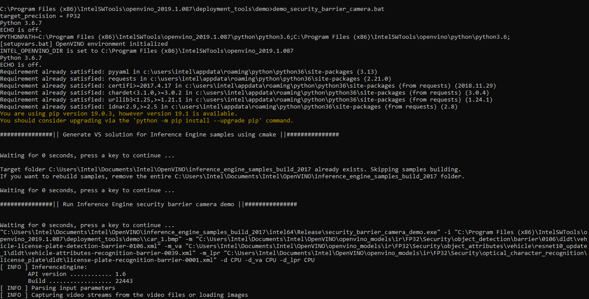
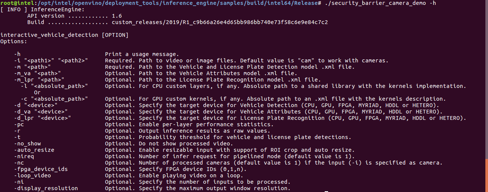
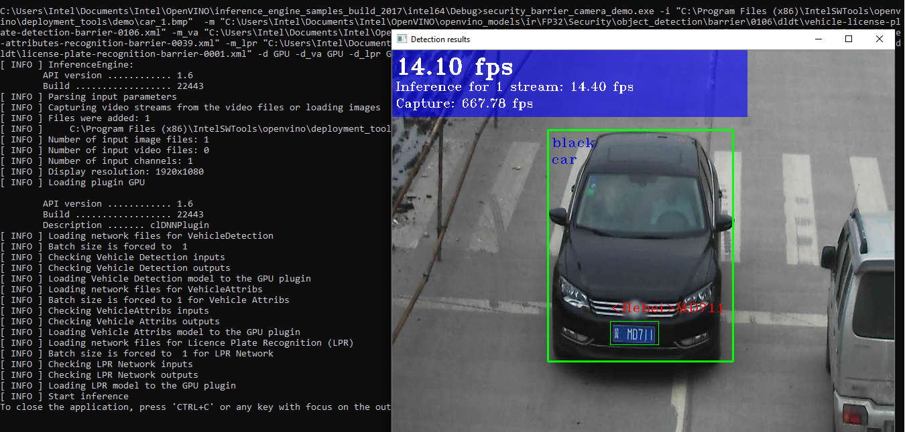

## Explore Intel® Distribution of OpenVINO™ toolkit Samples
### Introduction
The Intel® Distribution of OpenVINO™ toolkit is a comprehensive toolkit for quickly developing applications and Solutions that emulate human vision. Based on Convolutional Neural Networks (CNNs), the Toolkit extends computer vision workloads across Intel® hardware, maximizing performance.
### The Intel® Distribution of OpenVINO™ toolkit:
- Enables the CNN-based deep learning inference on the edge.
- Supports heterogeneous execution across Intel® computer vision accelerators, using a common API for the CPU, Intel® HD Graphics, Intel® Movidius™ Neural Compute Stick, and Intel® FPGA. However, we are not covering Intel® Movidius™ Neural Compute Stick and Intel® FPGA in this lab.
- Speeds time-to-market through an easy-to-use library of computer vision functions and pre-optimized kernels.
- Includes optimized calls for computer vision standards, including OpenCV, OpenCL™, and OpenVX™

### Pre-requisites
* **System Requirements**
  - Only the CPU, Intel® HD Graphics, and Intel® Movidius™ Neural Compute Stick options are supported for the Windows* installation. Linux* is required for using the FPGA or Intel® Movidius™. Myriad™ 2 VPU options.
* **Processors**
  - 6th – 8th Generation Intel® Core™ processor
  - Intel® Xeon® processor family v5 or v6
* **Operating System**
  - Ubuntu* 16.04.3 long-term support (LTS), 64-bit
  - CentOS* 7.4, 64-bit
  - Yocto Project* Poky Jethro* v2.0.3, 64-bit (for target only)

### Exploration
   This lab starts with exploring and understanding the Intel® Distribution of OpenVINO™ toolkit related packages installed in your device and running the prebuilt sample applications available with the Intel® Distribution of OpenVINO™ toolkit. Next lab session is to build a customized application using the Intel® Distribution of OpenVINO™ toolkit.

### Observation
Observe the folder structure available within the Intel® Distribution of OpenVINO™ toolkit and the performance difference between **CPU** and **GPU**.

### Learning Outcome
By the end of this module, the participant is expected to understand the Intel® Distribution of OpenVINO™ toolkit, installed folder structure and performance difference between **CPU** and **GPU**.
### To View the Packages installed on your Device
* **Intel® Distribution of OpenVINO™ toolkit installer**                                                 
 Intel® Distribution of OpenVINO™ toolkit by default installs at C:\Program Files (x86)\IntelSWTools\openvino\
* **Intel® Distribution of OpenVINO™ toolkit sample applications showing various capabilities**
Intel® Distribution of OpenVINO™ toolkit samples are made available in C:\Users\Intel\Documents\Intel\OpenVINO\inference_engine_samples_build_2017\samples.sln
* **Intel® Distribution of OpenVINO™ toolkit Documentation directory**
C:\Program Files (x86)\IntelSWTools\openvino\documentation
* **Intel® Distribution of OpenVINO™ toolkit pre-trained models**
C:\Program Files (x86)\IntelSWTools\openvino\deployment_tools\intel_models

### Understanding the Packages
Go to C:\Program Files (x86)\IntelSWTools\openvino\deployment_tools\ to understand the package contents.


- **bin** folder has 64-bit runtime libraries for OpenVINO™ toolkit samples
For example, cLDNN64.dll, cLDNNPlugin.dll and so on.
- **doc** folder has documentation for the Intel® Distribution of OpenVINO™ toolkit samples like classification, object detection, interactive_face_detection and so on.
- **include** folder has several header files required for developing application using the Intel® Distribution of OpenVINO™ toolkit.
- **lib** folder has 64-bit plugin library like inference engine and libiomp5md are useful for video applications.
-  Inferenceengine.dll is the software library for loading inference engine plugins for CPU, GPU and so on.
- libiomp5md.dll is a runtime library used for developing application using OpenMP.

### Running the Sample Programs
* **Security Barrier Camera Sample**                            
**Description**                           
Showcase Vehicle Detection, followed by Vehicle Attributes and License Plate Recognition are applied on top of Vehicle Detection. The vehicle attributes execution barrier reports the general vehicle attributes, like the vehicle type and colour, whether the type is something like car, van, or bus.
The application reads command line parameters and loads the specified models. The Vehicle/License-Plate Detection model is required, and the others are optional.

* **Set Environment variables using below commands**
```
cd C:\Program Files (x86)\IntelSWTools\openvino_2019.1.087\deployment_tools\demo
setupvars.bat
```

* **Build and Run Sample with CPU**
- Go to C:\Program Files (x86)\IntelSWTools\openvino_2019.1.087\deployment_tools\demo

- run demo_security_barrier_camera.bat




- **Output and Performance**
The output uses OpenCV to display the resulting frame with detections rendered as bounding boxes and text with vehicle attributes, license plate, detection time and frames per second (fps). The inference was done using a pre-trained model on **CPU**.


- **Manually Build Example**

- Navigate to: C:\Users\Intel\Documents\Intel\OpenVINO\inference_engine_samples_build_2017
- Open the samples.sln file and build the security_barrier_camera_demo.cpp sample.

Upon successful build, a security_barrier_camera_demo.exe file is available inside the intel64\Debug folder.

Running the application with –h option results with the following information:


For this document, we are not using all parameters. Participants are expected to explore multiple options.

- **Case 1:** To run the sample application on **CPU**, execute the following commands:

```
C:\Users\Intel\Documents\Intel\OpenVINO\inference_engine_samples_build_2017\intel64\Debug\security_barrier_camera_demo.exe -i "C:\Program Files (x86)\IntelSWTools\openvino\deployment_tools\demo\car_1.bmp"  -m "C:\Users\Intel\Documents\Intel\OpenVINO\openvino_models\ir\FP32\Security\object_detection\barrier\0106\dldt\vehicle-license-plate-detection-barrier-0106.xml" -m_va "C:\Users\Intel\Documents\Intel\OpenVINO\openvino_models\ir\FP32\Security\object_attributes\vehicle\resnet10_update_1\dldt\vehicle-attributes-recognition-barrier-0039.xml" -m_lpr "C:\Users\Intel\Documents\Intel\OpenVINO\openvino_models\ir\FP32\Security\optical_character_recognition\license_plate\dldt\license-plate-recognition-barrier-0001.xml" -d GPU

```


Next, we repeat the exercise with **GPU** and observe the performance.


- **case2:** To run the sample application on **GPU**, execute the following commands;

```
C:\Users\Intel\Documents\Intel\OpenVINO\inference_engine_samples_build_2017\intel64\Debug\security_barrier_camera_demo.exe -i "C:\Program Files (x86)\IntelSWTools\openvino\deployment_tools\demo\car_1.bmp"  -m "C:\Users\Intel\Documents\Intel\OpenVINO\openvino_models\ir\FP32\Security\object_detection\barrier\0106\dldt\vehicle-license-plate-detection-barrier-0106.xml" -m_va "C:\Users\Intel\Documents\Intel\OpenVINO\openvino_models\ir\FP32\Security\object_attributes\vehicle\resnet10_update_1\dldt\vehicle-attributes-recognition-barrier-0039.xml" -m_lpr "C:\Users\Intel\Documents\Intel\OpenVINO\openvino_models\ir\FP32\Security\optical_character_recognition\license_plate\dldt\license-plate-recognition-barrier-0001.xml" -d GPU

```
- **Output and Performance**
The output uses OpenCV to display the resulting frame with detections rendered as bounding boxes and text with vehicle attributes, license plate, detection time and fps. Compared to CPU acceleration, GPU acceleration is better in terms of detection time and fps.


- Press escape button to terminate

### Lessons Learned
- Intel® Distribution of OpenVINO™ toolkit, libraries, header and sample code files and available models
- Performance difference in detection time, fps with CPU and GPU

## Next Lab
[Face Detection using the Intel® Distribution of OpenVINO™ toolkit](./Face_detection.md)
