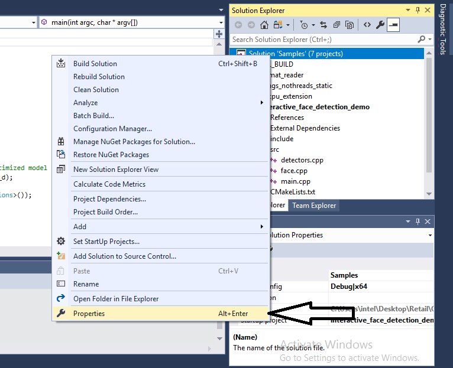
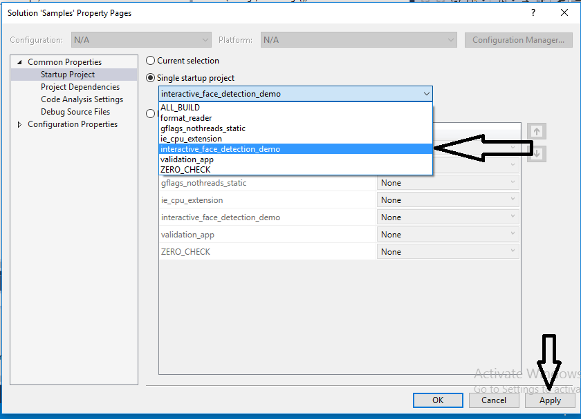
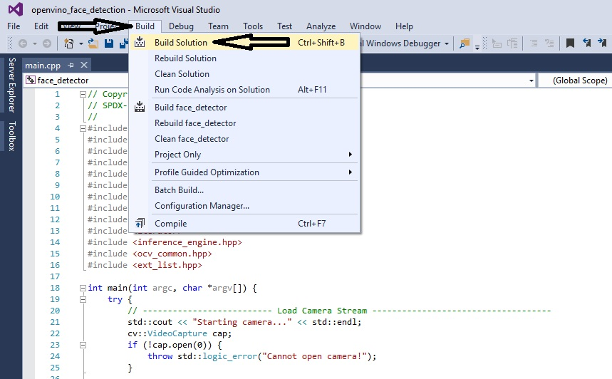
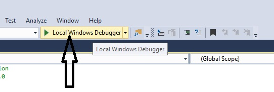

# Simple Face Detection using Intel® OpenVINO™ Toolkit (Windows)

### Lab Overview
We have done Face Detection in our previous module. In this tutorial you will build a simple application capable of detecting faces in a live camera stream using the Intel® OpenVINO™ Toolkit and an Intel® pretrained model.  

## Getting Started
Once Visual Studio has loaded you will notice there are multiple projects in our solution listed in the Solution Explorer in the right-hand pane. The main application project is called 'interactive_face_detection_demo' and contains the main application code. Before we get started we need to set this project to be the default for debugging. Right-click on the top level solution in the Solution Explorer window and select Properties


- In the Properties window select 'face_detector' in the Single startup project drop down box and then click Apply and finally OK to close the window.


- Expand the face_detector project in the Solution Explorer in the right-hand pane and navigate to the 'src' directory. Double-click on the main.cpp file to load the main application code.


## Understanding The Code
Take a look through the existing code using the comments as a guide. The code in it's current form simply uses the OpenCV library to capture frames from a USB camera and render them to a window. There is a crude timer implementation to give a rough guide to the number of frames per second being processed by the code in it's entirety.

The basic flow is outlined below:

 1. Open first camera device
 2. Grab a frame from the camera
 3. Start the main loop
	- Draw frame to a window
	- Grab next frame from camera
	- Loop until 'Esc' key is pressed

## Build & Run The Code

 - Build the solution: **Build->Build Solution**



 - Make sure the application built successfully by checking the **Output** log in the bottom left pane.


 - Ensure you have a USB camera connected to your host device before continuing.

 - Run the application by pressing **F5** on your keyboard or clicking the **'Local Windows Debugger'** button in the main toolbar.


 - A console window will load and begin showing debug output. Once the camera has loaded and the main loop begins a window will also appear showing the camera frames and fps values in the top left.


 - Press the **Esc** to stop the application

## Face Detection using Intel® OpenVINO™ Toolkit

A typical Inference Engine API workflow which we will implement in the following section is outlined below:

 1. **Select Plugin** - The Inference Engine uses a plugin architecture. An Inference Engine plugin is a software component which provides an implementation for inference on a given Intel® hardware device. There are a number of plugins included with the Intel® Distribution of OpenVINO™ Toolkit for a range of target hardware including CPU, GPU, VPU and FPGA.
 2. **Read the Intermediate Representation** - The Inference Engine requires an Intermediate Representation (IR) of a given model which can be generated by the **Model Optimizer** utility included with OpenVINO™. The Intermediate Representation files (xml+bin) need to be loaded into a **CNNNetwork** class which represents the network in host memory.
 3. **Configure inputs and outputs** - After loading the network we need to specify input and output precision and the layout of the network so resources can be allocated correctly when we create an **InferRequest** later on.
 4. **Load the network** - The Inference Engine plugin will compile and load the network to the desired device so inference can begin.
 5. **Set input data** - With the network loaded, you are able to create an **InferRequest** which allocates memory to hold the input and output. At this point you will also prepare the input by writing image data of the required size for the network to the allocated buffer for example.
 6. **Execute** - With input and output memory defined and the input data prepared we can execute the **InferRequest** which will populate the output memory with detection results.
 7. **Get the output** - After inference is completed you can retrieve the data from the output memory and parse the results.


## Asynchronous Infer Requests
The OpenVINO™ Inference Engine supports asynchronous requests which means you can execute the next request whilst processing the output from the current one. This is a good way of improving performance as you don't need to wait for the current request to finish before executing the next.

In this section we will modify our code to execute asynchronously and see how this impacts performance.

### 1.Select plugins for inference engine.
Select GPU as plugin device to load Face Detection pre trained optimized model

-Replace the following lines of code
```cpp

	//Select plugins for inference engine
	std::map<std::string, InferencePlugin> pluginsForDevices;

	//Select GPU as plugin device to load Face Detection pre trained optimized model
	InferencePlugin plugin = PluginDispatcher({ "../../../lib/intel64", "" }).getPluginByDevice("GPU");
	pluginsForDevices["GPU"] = plugin;
	//TODO: Age and Gender Detection 3


	//Load pre trained optimized data model for face detection
	FLAGS_Face_Model = "C:\\Program Files (x86)\\IntelSWTools\\openvino\\deployment_tools\\tools\\model_downloader\\Transportation\\object_detection\\face\\pruned_mobilenet_reduced_ssd_shared_weights\\dldt\\face-detection-adas-0001.xml";
	FaceDetection faceDetector(FLAGS_Face_Model, FLAGS_d, 1, false, FLAGS_async, FLAGS_t, FLAGS_r);
	faceDetector.load(pluginsForDevices["GPU"]);


```
with this:

```cpp

		FLAGS_d = "GPU";
		//Select plugins for inference engine
		std::map<std::string, InferencePlugin> pluginsForDevices;

		//Select GPU as plugin device to load Face Detection pre trained optimized model
		InferencePlugin plugin = PluginDispatcher().getPluginByDevice(FLAGS_d);
		if ((FLAGS_d.find("CPU") != std::string::npos)) {
			plugin.AddExtension(std::make_shared<Extensions::Cpu::CpuExtensions>());

		}  
		pluginsForDevices[FLAGS_d] = plugin;
		//TODO: Age and Gender Detection 3


		//Load pre trained optimized data model for face detection
		FLAGS_Face_Model = "C:\\Program Files (x86)\\IntelSWTools\\openvino\\deployment_tools\\tools\\model_downloader\\Transportation\\object_detection\\face\\pruned_mobilenet_reduced_ssd_shared_weights\\dldt\\face-detection-adas-0001.xml";
		FaceDetection faceDetector(FLAGS_Face_Model, FLAGS_d, 1, false, FLAGS_async, FLAGS_t, FLAGS_r);
		faceDetector.load(pluginsForDevices[FLAGS_d]);
		//TODO: Async Infer Requests 1

```


### 2. Adding OpenCV objects to store additional camera frames
We need to add two OpenCV **Mat** objects to store an additional camera frame so we are able to work with two frames at once. Clone the current frame and read the next frame. Start the timer to calculate the throughput.
- Replace **//TODO: Async_Infer_Requests 1**  with the following lines of code.

``` cpp

	Timer timer;
	size_t framesCounter = 0;
	bool isLastFrame;
	bool frameReadStatus;
	cv::Mat prev_frame, next_frame;
	bool isModeChanged = false;

	// Reading the next frame
	frameReadStatus = cap.read(frame);


```


### 3. Populate the input for the next request.
We now need to make some modification to the **Main Loop**. We no longer want to populate the current **InferRequest** at the start of the loop as this only needs to be done once before the loop begins. We now need to grab the **next** frame from the camera and populate the input for the **next** request at the start of the loop. We can also execute the next request asynchronously before we move on to processing the output from the current request.

-Replace this existing **Main Inference Loop** with the following lines of code.

``` cpp

	// Main inference loop
	while (true) {
		//TODO: Cloud integration 2
		//Grab the next frame from camera and populate Inference Request
		cap.grab();
		faceDetector.enqueue(frame);

		//Submit Inference Request for face detection and wait for result
		faceDetector.submitRequest();
		faceDetector.wait();

		//TODO: Age and Gender Detection 5
		faceDetector.fetchResults();

		//TODO: Age and Gender Detection 6

		for (auto & result : faceDetector.results) {
			cv::Rect rect = result.location;

			//TODO: Age and Gender Detection 7

			// Giving same colour to male and female
			auto rectColor = cv::Scalar(0, 255, 0);

			cv::rectangle(frame, result.location, rectColor, 1);
		}

		if (-1 != cv::waitKey(1))
			break;

		cv::imshow("Detection results", frame);

		if (!cap.retrieve(frame)) {
			break;
		}
		//TODO: Cloud integration 3
	}

 ```

With this:

``` cpp

	// Main inference loop
	while (true) {
		timer.start("total");
		framesCounter++;
		isLastFrame = !frameReadStatus;


		// No valid frame to infer if previous frame is the last
		if (!isLastFrame) {
			faceDetector.enqueue(frame);
			faceDetector.submitRequest();
		}
		// Retrieving face detection results for the previous frame
		faceDetector.wait();
		faceDetector.fetchResults();

		if (!isLastFrame) {
			frameReadStatus = cap.read(next_frame);
		}

		auto prev_detection_results = faceDetector.results;

		for (auto & result : prev_detection_results) {
			cv::Rect rect = result.location;

			// Giving same colour to male and female
			auto rectColor = cv::Scalar(0, 255, 0);

			cv::rectangle(next_frame, result.location, rectColor, 1);
		}

        //TODO: Async_Infer_Requests 2
		const int key = cv::waitKey(1);
		if (27 == key)  // Esc
			break;

		cv::imshow("Detection results", frame);

		if (!cap.retrieve(frame)) {
			break;
		}

		if (9 == key) {  // Tab
			faceDetector.isAsync ^= true;

		}


	}


```

### 4. Displaying the throughput

- Display the throughput in fps on the camera console window.
- Replace **//TODO: Async_Infer_Requests 2**  with the following lines of code.

```cpp
		std::ostringstream out;
		out << "Wallclock time " << (faceDetector.isAsync ? "(TRUE ASYNC)      " : "(SYNC, press Tab) ");
		cv::putText(next_frame, out.str(), cv::Point2f(10, 50), cv::FONT_HERSHEY_TRIPLEX, 0.6, cv::Scalar(0, 0, 255));
		out.str("");
		out << "Total image throughput: " << std::fixed << std::setprecision(2)
			<< 1000.f / (timer["total"].getSmoothedDuration()) << " fps";
		cv::putText(next_frame, out.str(), cv::Point2f(10, 20), cv::FONT_HERSHEY_TRIPLEX, 0.6,
			cv::Scalar(255, 0, 0));
		//TODO: Async_Infer_Requests 3
```


### 5. Swapping the requests before next iteration.
 - Finally, instead of grabbing the next frame from the camera at the end of the **Main Loop** we need to swap the **previous** and **next** requests before the loop starts it's next iteration and close the timer.

- Replace **//TODO: Async_Infer_Requests 3**  with the following lines of code.

``` cpp
	prev_frame = frame;
	frame = next_frame;
	next_frame = cv::Mat();
	timer.finish("total")    

```


 - That's all the changes we need to make so we can now **build the solution** once again. Make sure the code built successfully by checking the **Output** log in the bottom left pane.

 - Run the application by pressing **F5** on your keyboard or clicking the **'Local Windows Debugger'** button in the main toolbar. Once again run the application for a while and take note of the average **fps** value which should now be higher than before.

 - Press the **Esc** to stop the application

## Running On Intel® Graphics
As mentioned previously the OpenVINO™ Inference Engine comes with plugins to support a range of Intel® hardware.

 - Before we make any modifications we can use the **Performance Profiler** utility in Visual Studio to analyse the **CPU** and **GPU** usage of the current code. To run the application using the **Performance Profiler**:
     - Select **Debug->Performance Profiler...**
     - Make sure **CPU Usage** and **GPU Usage** are ticked and click **Start** to begin profiling.


 - The application will load as normal whilst the profiling tool records usage data in the background. Let the application run for a few seconds before pressing the **Esc** key to close the application and stop the profiling session.

 - Now go back to Visual Studio and take a look at the **GPU Utilization** and **CPU** graphs. Notice that CPU usage is high and GPU usage is low as we would expect when using the CPU plugin for inference.


 - Now we will try using the integrated **GPU** which requires a modification which is performance related. For best performance on GPU it is generally best to use a model with **FP16** data type as appose to the **FP32** model we have been using up to now. All of the pretrained models are provided with FP16 and FP32 variants so this is a simple case of changing the **model** variable to point to the **FP16** model.

``` cpp
FLAGS_Face_Model= "C:\\Program Files (x86)\\IntelSWTools\\openvino\\deployment_tools\\tools\\model_downloader\\Transportation\\object_detection\\face\\pruned_mobilenet_reduced_ssd_shared_weights\\dldt\\face-detection-adas-0001-fp16.xml";

```

 - **Build the solution** and make sure the code compiled successfully by checking the **Output** log in the bottom left pane.

 - Run the application using the **Performance Profiler** once again to monitor **CPU** and **GPU** usage. You will notice **CPU usage** is significantly reduced whilst the application is running whereas **GPU usage** is increased.


## Running On Intel® Myriad™ VPU
The **Myriad™** Inference Engine plugin supports VPU devices such as the Intel® Neural Compute Stick. Dedicated accelerators such as this offer an alternative to traditional CPU and GPU hardware which can be useful for adding computer vision workloads to existing solutions where CPU and GPU are already heavily utilised.

 - VPU devices only support **FP16** data type so we will need to use the FP16 variant of our pretrained face detection model as we did when running on the GPU in the previous section.

 - In order to run on an Intel® Myriad™ VPU or CPU we simply change the **device**  to **MYRIAD** or **CPU**.
 - Replace the following lines of code:

``` cpp

	//Select plugins for inference engine
	std::map<std::string, InferencePlugin> pluginsForDevices;

	//Select GPU as plugin device to load Face Detection pre trained optimized model
	InferencePlugin plugin = PluginDispatcher({ "../../../lib/intel64", "" }).getPluginByDevice("GPU");
	pluginsForDevices["GPU"] = plugin;
	//TODO: Age and Gender Detection 3


	//Load pre trained optimized data model for face detection
	FLAGS_Face_Model = "C:\\Program Files (x86)\\IntelSWTools\\openvino\\deployment_tools\\tools\\model_downloader\\Transportation\\object_detection\\face\\pruned_mobilenet_reduced_ssd_shared_weights\\dldt\\face-detection-adas-0001.xml";
	FaceDetection faceDetector(FLAGS_Face_Model, FLAGS_d, 1, false, FLAGS_async, FLAGS_t, FLAGS_r);
	faceDetector.load(pluginsForDevices["GPU"]);


```
with this in case of MYRIAD:

```cpp
		FLAGS_d = "MYRIAD";
		//Select plugins for inference engine
		std::map<std::string, InferencePlugin> pluginsForDevices;

		//Select GPU as plugin device to load Face Detection pre trained optimized model
		InferencePlugin plugin = PluginDispatcher().getPluginByDevice(FLAGS_d);
		if ((FLAGS_d.find("CPU") != std::string::npos)) {
			plugin.AddExtension(std::make_shared<Extensions::Cpu::CpuExtensions>());

		}  
		pluginsForDevices[FLAGS_d] = plugin;
		//TODO: Age and Gender Detection 3


		//Load pre trained optimized data model for face detection
		FLAGS_Face_Model = "C:\\Program Files (x86)\\IntelSWTools\\openvino\\deployment_tools\\tools\\model_downloader\\Transportation\\object_detection\\face\\pruned_mobilenet_reduced_ssd_shared_weights\\dldt\\face-detection-adas-0001-fp16.xml";
		FaceDetection faceDetector(FLAGS_Face_Model, FLAGS_d, 1, false, FLAGS_async, FLAGS_t, FLAGS_r);
		faceDetector.load(pluginsForDevices[FLAGS_d]);
```
with this in case of CPU:


```cpp
		FLAGS_d = "CPU";
		//Select plugins for inference engine
		std::map<std::string, InferencePlugin> pluginsForDevices;

		//Select GPU as plugin device to load Face Detection pre trained optimized model
		InferencePlugin plugin = PluginDispatcher().getPluginByDevice(FLAGS_d);
		if ((FLAGS_d.find("CPU") != std::string::npos)) {
			plugin.AddExtension(std::make_shared<Extensions::Cpu::CpuExtensions>());

		}  
		pluginsForDevices[FLAGS_d] = plugin;
		//TODO: Age and Gender Detection 3


		//Load pre trained optimized data model for face detection
		FLAGS_Face_Model = "C:\\Program Files (x86)\\IntelSWTools\\openvino\\deployment_tools\\tools\\model_downloader\\Transportation\\object_detection\\face\\pruned_mobilenet_reduced_ssd_shared_weights\\dldt\\face-detection-adas-0001.xml";
		FaceDetection faceDetector(FLAGS_Face_Model, FLAGS_d, 1, false, FLAGS_async, FLAGS_t, FLAGS_r);
		faceDetector.load(pluginsForDevices[FLAGS_d]);

```    


 - **Build the solution** and make sure the code compiled successfully by checking the **Output** log in the bottom left pane.

 - Ensure you have an Intel® Neural Compute Stick plugged into your host before continuing.

 - Run the application using the **Performance Profiler** once again to monitor **CPU** and **GPU** usage. You will notice that using a dedicated VPU for inference has drastically reduced the utilisation of the **CPU** and **GPU** which frees these resources up for other workloads.


### Lesson Learnt
We looked at ways of improving performance by taking advantage of asynchronous calls in the Inference Engine API before exploring the ease of which the same code can be run on various different hardware in the Intel® portfolio such as GPUs and Intel® Myriad™ VPUs.


## Next Lab
[Age and Gender Detection using the Intel® Distribution of OpenVINO™ toolkit](./Age_Gender_Detection.md)
