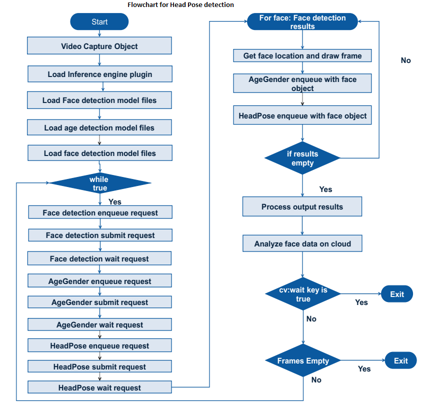

# Head Pose Detection using the Intel® Distribution of OpenVINO™ toolkit
### Lab Overview
We have done Face and Age, Gender Detection in our previous module. Now, we identify Headpose for the identified faces.    
We  build upon our Face Detection code and add Age ,Gender add HeadPose identification code in this module.

**Class diagram for HeadPose Detection**


### Tasks TODO for HeadPose Detection:
-	Include CPU as plugin device for headpose detection inference.
-	Load pre-trained data model for Headpose detection.
-	Once Face Detection result is available, submit inference request for Headpose Detection
-	Mark the identified faces inside rectangle and draw Raw, Yaw and Pitch axis.
-	Observe HeadPose Detection in addition to face.



### 1. Select CPU as plugin device
In previous labs,  Face, Age and Gender detection is done. Now, the application will be extended with head pose detection. Here, the CPU will be used as plugin device for inferencing head pose detection. Which is already selected for Age and Gender detection in previous lab.


### 2. Load Pre-trained Optimized Model for HeadPose Inferencing
Load pre-retained optimized model for head pose detection on CPU as CPU is already selected as plugin device previously.
- Replace **#TODO: HeadPose Detection 1** with the following lines of code

```cpp
FLAGS_m_hp = "C:\\Program Files (x86)\\IntelSWTools\\openvino\\deployment_tools\\tools\\model_downloader\\Transportation\\object_attributes\\headpose\\vanilla_cnn\\dldt\\head-pose-estimation-adas-0001.xml";
HeadPoseDetection headPoseDetector(FLAGS_m_hp, FLAGS_d_hp, FLAGS_n_hp, FLAGS_dyn_hp, FLAGS_async);
headPoseDetector.load(pluginsForDevices["CPU"]);

```

### 3. Start Inferencing
Till now Plugin device is selected, and loaded pre-trained optimized model for inferencing. Now it is time to start inferencing.
- Replace **#TODO: HeadPose Detection 2** with the following lines of code

```cpp
//Submit Inference Request for HeadPose detection and wait for result
headPoseDetector.submitRequest();
headPoseDetector.wait();


```

### 4. Use identified Face for HeadPose Detection
Clip the identified Faces and send inference request for detecting head pose
- Replace **#TODO: HeadPose Detection 3** with the following lines of code

```cpp
headPoseDetector.enqueue(face1);

```

### 5. Calculate attentivity index
Now, the attentivityindex will be calculated using Yaw angle available from head pose inference result.
- Replace **#TODO: HeadPose Detection 4** with the following lines of code

```cpp
if (index < headPoseDetector.maxBatch) {
cv::Point3f center(rect.x + rect.width / 2, rect.y + rect.height / 2, 0);
headPoseDetector.drawAxes(frame, center, headPoseDetector[index], 50);
if (headPoseDetector.yaw > -0.4 && headPoseDetector.yaw < -0.001)
{
attentivityindex++;
}
}

 ```

### The Final Solution
Keep the TODOs as it is. We will re-use this program during Cloud Integration.     
For complete solution click on following link [headpose_detection](./solutions/headpose.md)
- Build the solution in visual studio
- Executable will be generated at ***C:\Users\Intel\Desktop\Retail\OpenVINO\deployment_tools\inference_engine\samples\build\intel64\Debug*** directory.
- Run the application by using below command. Make sure camera is connected to the device.
- Open command prompt and type this command

```
> C:\"Program Files (x86)"\IntelSWTools\openvino\bin\setupvars.bat
> C:\Users\Intel\Desktop\Retail\OpenVINO\deployment_tools\inference_engine\samples\build\intel64\Debug\interactive_face_detection_demo.exe
 ```

- On successful execution, Face, Age  Gender and HeadPose will get detected.

### Lesson Learnt
In addition to Face and AgeGender added HeadPose Detection using the Intel® Distribution of OpenVINO™ toolkit.

## Next Lab
[Analyze face data on Cloud](./Analyse_face_data_on_cloud.md)
